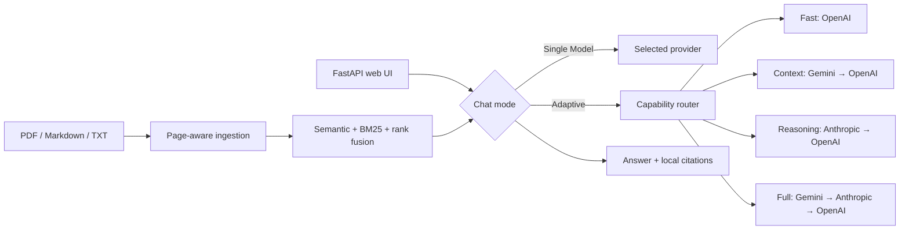

# Adaptive Knowledge Assistant

A source-grounded Python knowledge assistant with hybrid retrieval, explicit
citations, and deterministic multi-provider orchestration across Anthropic,
OpenAI, and Gemini.

[](https://github.com/sunnatbek-dev/adaptive-knowledge-assistant/actions/workflows/ci.yml)
[](docs/evaluation-report.md)
[](pyproject.toml)
[](LICENSE)

> Portfolio release for a mid-level AI/LLM engineering role. The project
> emphasizes measurable retrieval, provider-neutral contracts, safe workflow
> control, and honest limitations rather than an unverified all-powerful-AI
> claim.

## Verified snapshot

| Signal | Result |
| --- | ---: |
| Unit tests | 774 deterministic tests |
| Offline integration tests | 24 passing, 3 paid smoke tests skipped by default |
| Total offline tests | **798 passing** |
| Branch coverage | **96.69%** on Python 3.14 (95% gate) |
| Knowledge retrieval | Hit Rate@3 **1.000**, Recall@3 **1.000**, MRR **0.963** |
| Route benchmark | **24/24** expected decisions |
| Estimated route requests | **48** vs **72** always-FULL baseline |

The retrieval corpus contains 27 labeled questions about the project itself.
See the reproducible [evaluation report](docs/evaluation-report.md) for baseline
comparison, failure disclosure, and limits.

## What it demonstrates

- **Grounded answers:** Markdown, TXT, and text-based PDF ingestion; hybrid
  semantic + BM25 retrieval; source cards and page-aware PDF citations.
- **Two explicit modes:** one user-selected provider, or an Adaptive
  Multi-Model workflow selected by a deterministic capability router.
- **Reliable orchestration:** validated handoffs, bounded retries, ordered SSE
  progress, cooperative cancellation, rollback, and content-free metrics.
- **Framework-independent core:** provider adapters sit behind small Python
  contracts instead of leaking vendor response objects across the application.
- **Evaluation-first development:** retrieval and routing benchmarks, offline
  integration tests, tracing, CI gates, and opt-in paid smoke tests.

## 60-second local demo

```bash
git clone https://github.com/sunnatbek-dev/adaptive-knowledge-assistant.git
cd adaptive-knowledge-assistant
python -m venv .venv
source .venv/bin/activate
python -m pip install -e '.[embeddings,documents,web]'
cp .env.example .env
adaptive-knowledge
```

Open <http://127.0.0.1:8000>. The status page and document catalog are safe to
open without provider keys. Add only the provider keys and model names you want
to use to `.env`; Adaptive Multi-Model requires all three providers. The first
document indexing run downloads the configured local embedding model.

Alternatively, start the same local demo in a non-root container:

```bash
docker compose up --build
```

## Product flow



The shared retrieval resources keep all modes on one document index while
conversation histories remain isolated by provider and mode.

## Web API

| Method | Endpoint | Purpose |
| --- | --- | --- |
| `GET` | `/api/status` | Secret-free provider readiness and bounded metrics |
| `GET/POST` | `/api/documents` | List or index PDF, Markdown, and TXT documents |
| `DELETE` | `/api/documents/{document_id}` | Remove one source from the index |
| `POST` | `/api/chat/stream` | SSE route, stage, citation, answer, and error events |
| `POST` | `/api/runs/{run_id}/cancel` | Request cooperative cancellation |
| `POST` | `/api/conversations/reset` | Clear one isolated local conversation |

Interactive OpenAPI documentation is available at `/api/docs`.

## Reproduce the evidence

```bash
# Default unit suite; never calls a paid API
pytest

# Offline multi-component workflows
pytest -m integration

# Coverage gate
pytest --cov=ai_sdk --cov-report=term-missing

# Semantic vs hybrid retrieval + route benchmark
python app/evaluate_knowledge.py

# Tracked runtime-data and secret audit
python app/audit_repository.py
```

Real provider smoke tests require both a key and an explicit
`RUN_<PROVIDER>_INTEGRATION=1` flag. Normal CI never enables those flags.

## Engineering decisions

1. **Explicit contracts over orchestration magic.** Provider adapters translate
   one model turn; retrieval, tools, agents, and handoffs remain testable without
   a vendor SDK.
2. **Deterministic routing over another router model call.** The selected route
   is cheap, explainable, and regression-testable, with known ambiguity limits.
3. **One retry owner and safe cancellation boundaries.** Hidden provider retries
   are disabled, permanent failures are not retried, and cancellation does not
   pretend to interrupt an in-flight blocking provider request.

The full rationale is in [engineering decisions](docs/engineering-decisions.md).

## Current boundaries

Version 0.1.0 is a **local, single-user portfolio application**. It is not a
hosted multi-tenant SaaS. Authentication, billing, PostgreSQL, queues,
Kubernetes, Office parsing, OCR, fine-tuning, malware scanning, and public abuse
controls are intentionally out of scope. Generated-answer correctness still
needs a human-labeled dataset and calibrated judge before it can be claimed as
a benchmark.

## Documentation

- [Capabilities and SDK reference](docs/capabilities.md)
- [Evaluation report](docs/evaluation-report.md)
- [Knowledge corpus](docs/knowledge_base)
- [Engineering decisions](docs/engineering-decisions.md)
- [Security policy](SECURITY.md)
- [Career and interview kit](docs/career-kit.md)
- [Release notes](docs/release-notes-v0.1.0.md)
- [Contributing](CONTRIBUTING.md)

## License

MIT © 2026 Sunnatbek. See [LICENSE](LICENSE).
